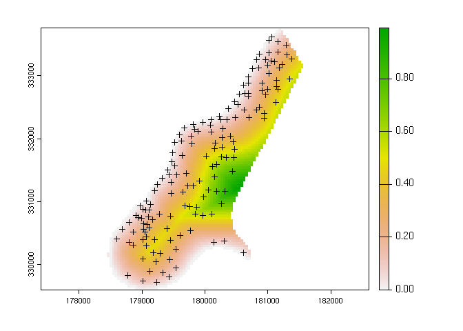
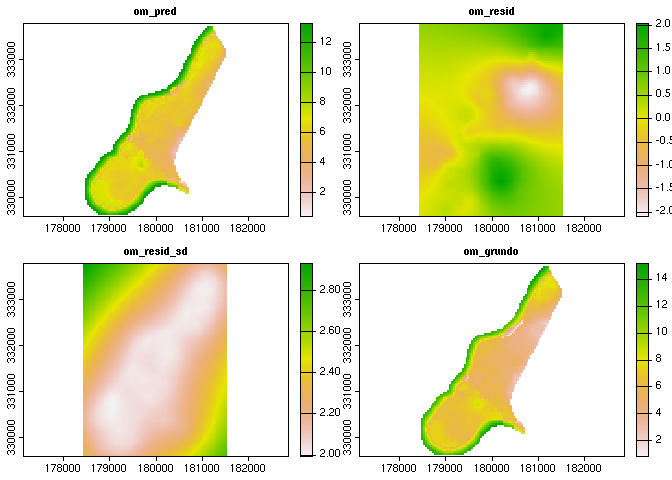
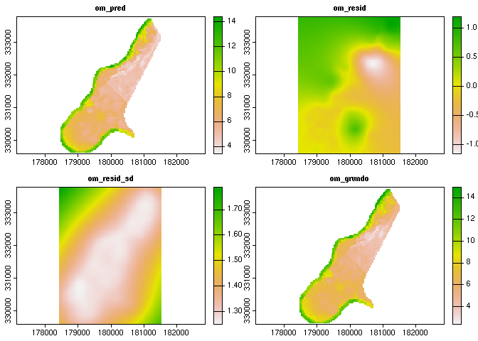
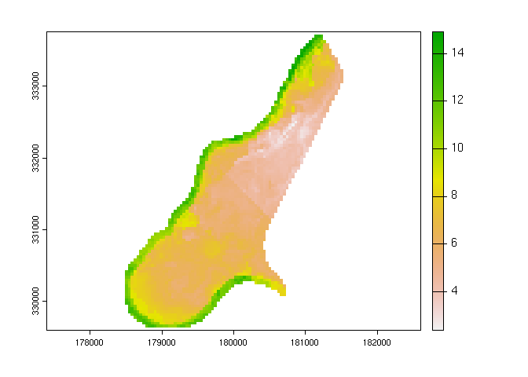

<!-- README.md is generated from README.Rmd. Please edit that file -->

# {grundo}

<!-- badges: start -->
<!-- badges: end -->

Welcome to the “{grundo} mundo.” The goal of {grundo} is to provide a
simple, modern R interface for creating gridded maps of soils, with a
focus on preparing observational data for statistical analysis and
evaluating the models that predict soil properties or classes.

The package also seeks to provide a light compatibility layer between
the {terra} and {gstat} packages. Note you do not need to use {terra}
classes, {sf}, {sp}, and {stars} are fully supported.

# {grundo} Models

A {grundo} model includes a primary model trained to predict `variable`
using values extracted from `predictors` at `samples` locations. This
model is selected with the `model` argument from one of several options
described in subsequent sections.

Each run of `grundo::grundo()` includes an ordinary kriging step to
interpolate residuals from the primary model and estimate the spatial
pattern of the errors in the training area.

The first layer of resulting prediction `SpatRaster` is the primary
model prediction. The second layer is the interpolated residuals, and
generally will have positive and negative values distributed around
zero. The sum of the two grids will give a more realistic estimate of
values in the training area given the known, observed point values.

- If there is no significant spatial component to the errors, the
  residual kriging value is the mean value of the residual errors from
  the training data. This mean error value is also assumed for
  predictions made outside the extent of the training data.

## Installation

You can install the development version of {grundo} from GitHub with
{remotes}:

``` r
if (!require("remotes")) install.packages("remotes")
remotes::install_github("brownag/grundo")
```

## Example

This example uses the classic `meuse` dataset to demonstrate prediction
of surface soil organic matter content (%) along the Meuse River. These
datasets have been augmented with additional DEM-derived (SRTM) data for
more continuous numeric predictors.

``` r
library(grundo)
library(terra)
#> terra 1.6.47

samples <- vect(system.file("extdata", "meuse.gpkg", package = "grundo"))
predictors <- rast(system.file("extdata", "meuse.grid.ex.tif", package = "grundo"))

## to use classic `meuse` datasets from {sp} package
# data(meuse, package = "sp")
# data(meuse.grid, package = "sp")
# predictors <- rast(meuse.grid, crs = "EPSG:28992")
# samples <- vect(meuse, geom = c("x", "y"), crs = "EPSG:28992")
```

# Dependent Variable

First we select a dependent variable that is a soil property, such as
`"om"` (surface soil organic matter percentage).

``` r
variable <- "om"
```

# Predictors and Samples

Next we will set up a {terra} `SpatRaster` containing the grids of our
predictors, and a `SpatVector` of points where soil properties have been
measured. For this example we construct these objects from `data.frame`
datasets defined in the {sp} package.

``` r
# remove observations that are missing organic matter %
samples <- samples[!is.na(samples[[variable]][[1]]), ]

# visual inspection
plot(predictors[[3]])
points(samples, pch = "+", cex = 1)
```



There are several other soil properties of interest that can be used,
see `names(samples)`

``` r
names(predictors)
#> [1] "part.a"    "part.b"    "dist"      "soil"      "ffreq"     "elevation"
#> [7] "slope"

names(samples)
#>  [1] "cadmium"   "copper"    "lead"      "zinc"      "elev"      "om"       
#>  [7] "lime"      "landuse"   "dist.m"    "ID"        "part.a"    "part.b"   
#> [13] "dist"      "soil"      "ffreq"     "elevation" "slope"
```

# Models

## Cubist model with `Cubist::cubist()`

`grundo()` supports {Cubist} models with `model="cubist"`

``` r
# cubist with {Cubist} + OK residuals
x <- grundo(
  predictors = predictors,
  samples = samples,
  variable = variable,
  model = "cubist",
  vgm_model = "Exp"
)
#> Loading required namespace: Cubist
#> Warning in gstat::fit.variogram(grundo::variogram(samples, rfm),
#> gstat::vgm(vgm_model)): No convergence after 200 iterations: try different
#> initial values?
#> [using ordinary kriging]
#> [using ordinary kriging]

plot(x$result)
```



``` r
plot(sum(x$result[[1:2]]))
```


## Random Forest model with `ranger::ranger()`

`grundo()` supports {ranger} (Random Forest) models with
`model="ranger"`

``` r
# random forest with {ranger} + OK residuals
y <- grundo(
  predictors = predictors,
  samples = samples,
  variable = variable,
  model = "ranger",
  vgm_model = "Exp"
)
#> Loading required namespace: ranger
#> Warning in lapply(r, as.numeric): NAs introduced by coercion

#> Warning in lapply(r, as.numeric): NAs introduced by coercion
#> Warning in gstat::fit.variogram(grundo::variogram(samples, rfm),
#> gstat::vgm(vgm_model)): No convergence after 200 iterations: try different
#> initial values?
#> [using ordinary kriging]
#> [using ordinary kriging]

plot(y$result)
```



``` r
plot(sum(y$result[[1:2]]))
```



## `grundo()` “Ensemble”

We can take the average of several `grundo()` runs for an “ensemble”
estimate.

``` r
plot(mean(c(sum(x$result[[1:2]]), sum(y$result[[1:2]]))))
```


